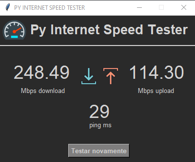

# py-internet-speed-tester
Aplicação que testa a velocidade da sua internet.

Retorna a velocidade de Download, Upload e a Latência (ping) da conexão atual.

Para utilizar, basta clicar uma vez no botão "Iniciar Teste" e aguardar o programa fazer a leitura da velocidade.
Se desejar, pode realizar um novo teste clicando no botão "Testar novamente"

